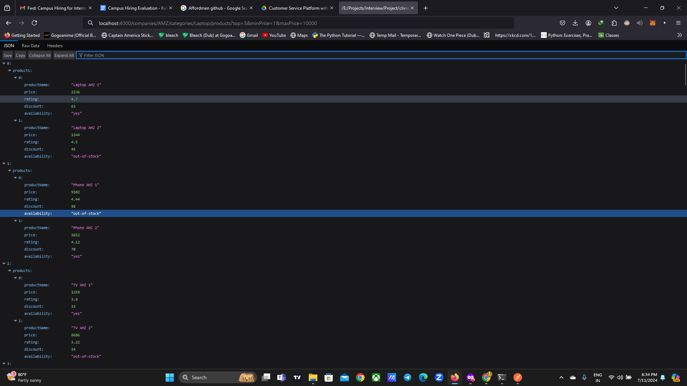

<!DOCTYPE html>
<html lang="en">
<head>
  <meta charset="UTF-8">
  <meta name="viewport" content="width=device-width, initial-scale=1.0">
  <title>README with HTML Image</title>
</head>
<body>
  <h1>My Project README</h1>
  
  
This is a paragraph introducing my project.

  
  
  
  
Here's some more text about my project.

</body>
</html>
